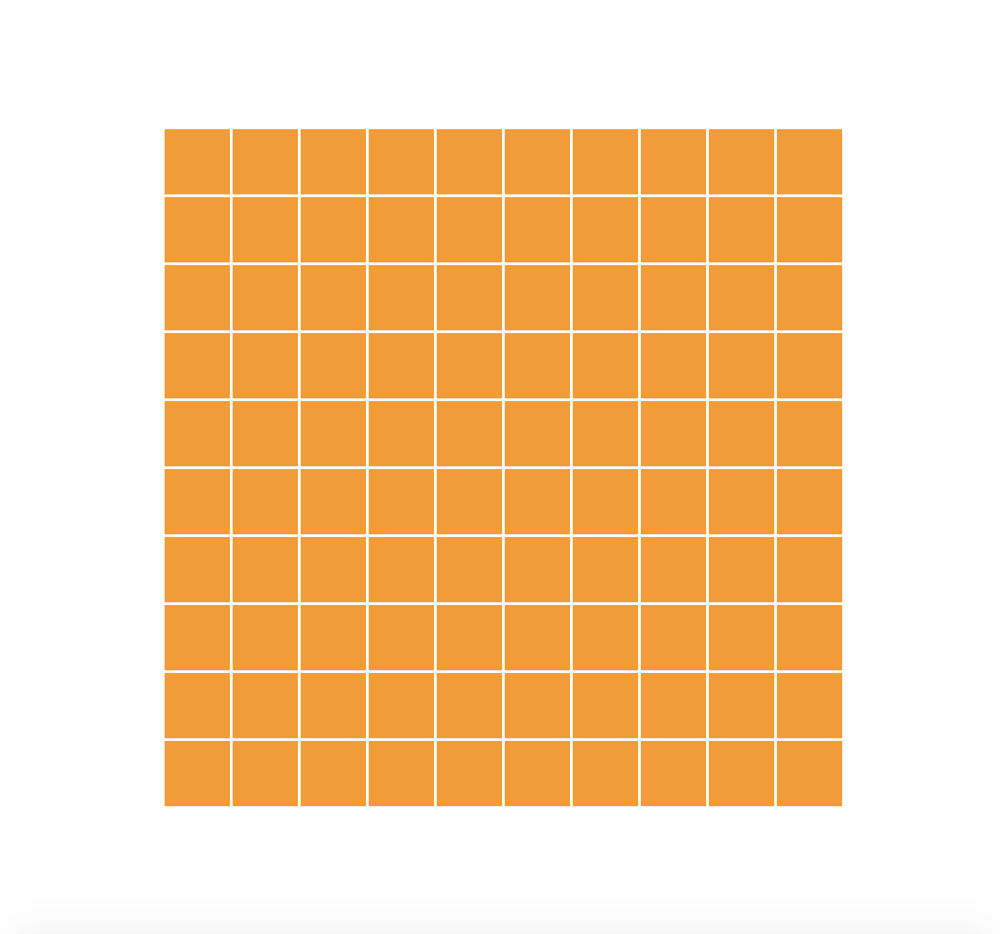
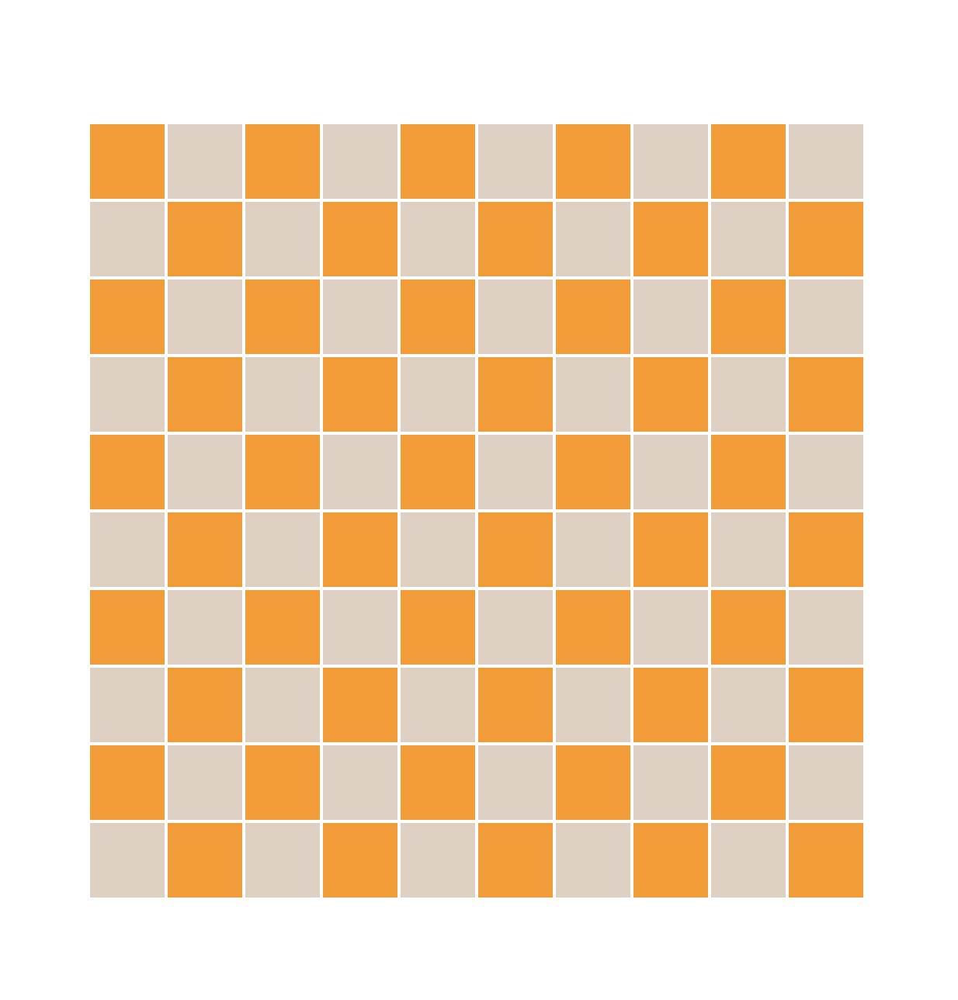
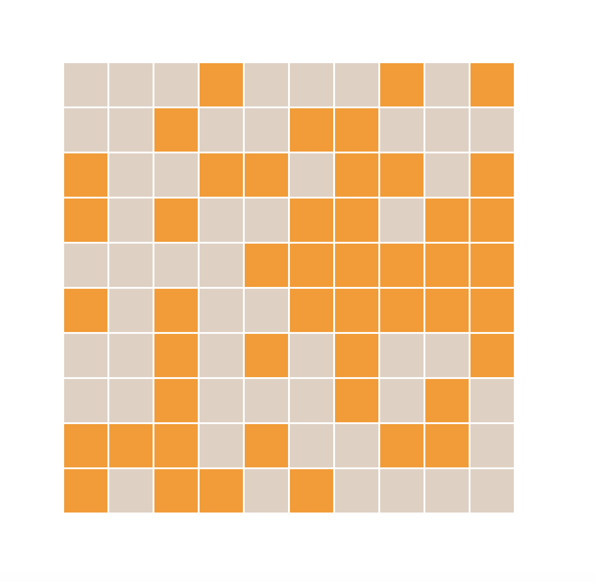

## Tasks

1. Make a 10 * 10 grid like below image using JS Dom Manupulation

2. Make the grid to changes color of it's even or odd cells every half second Like shown below.

3. Make the grid to changes color of it's cells changes its color randomly every half second Like shown below.

